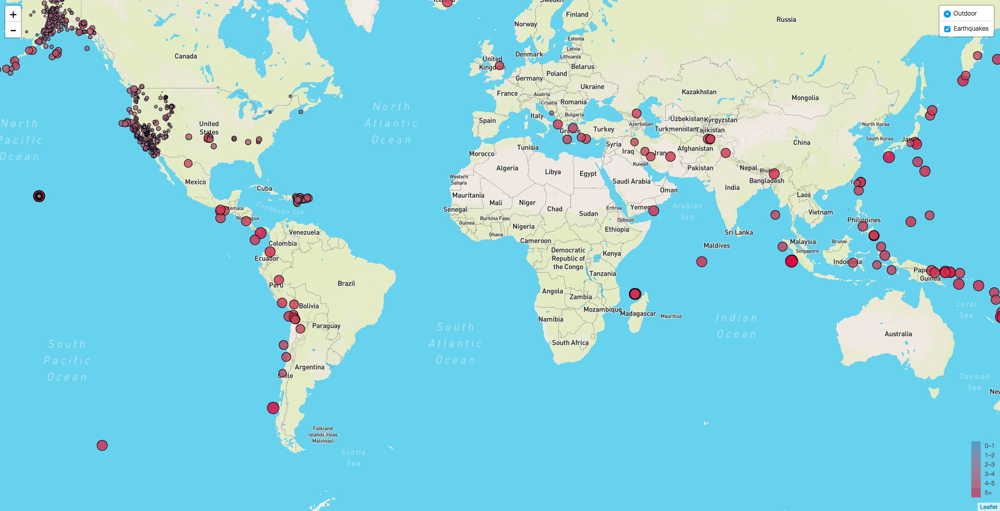

This is a project where I pulled data from a JSON file from the United States Geological Survey, or USGS website. The file takes all of the earthquakes measured in the world from the past 7 days. I then binded the measurements to points on a leaflet map which correlates the size of the earthquake magnitude to the marker size and color on the map. The map is updated weekly.

